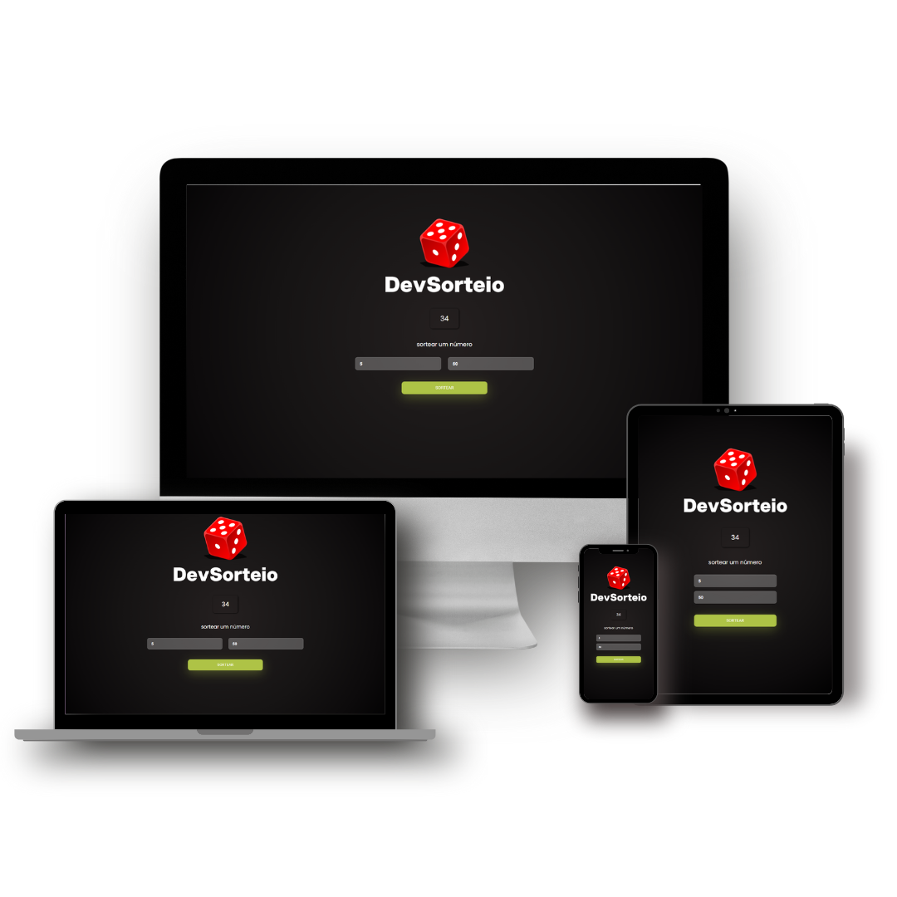

# DevSorteio
 

  <a href="#house-About-the-project">About</a>&nbsp;&nbsp;&nbsp;|&nbsp;&nbsp;&nbsp;
  <a href="#computer-Technologies">Technologies</a>

 

## :house: About the project

This project is a simple web application that allows the user to pick two random numbers and then draw a number between those two values. It was developed using HTML, CSS and JavaScript.
  
Este projeto é uma aplicação web simples que permite ao usuário escolher dois números aleatórios e, em seguida, sorteia um número entre esses dois valores. Foi desenvolvido utilizando HTML, CSS e JavaScript.
  

## How to use
1. Clone or download this repository or enter through the <a href="https://thiago-weslley.github.io/DevSorteio/" target="_blank">link</a>.
2. Open the `index.html` file in your preferred browser.
3. Enter the two desired random numbers into the appropriate fields.
4. Click on the "Draw" button to generate the drawn number.
5. The drawn number will be displayed on the screen.
  
## Como utilizar
1. Clone ou faça o download deste repositório ou entre pelo <a href="https://thiago-weslley.github.io/DevSorteio/" target="_blank">link</a>.
2. Abra o arquivo `index.html` no seu navegador preferido.
3. Insira os dois números aleatórios desejados nos campos apropriados.
4. Clique no botão "Sortear" para gerar o número sorteado.
5. O número sorteado será exibido na tela.

  

## :computer: Technologies 

  

  

  

